# Database Entity Relationship Diagram

This diagram shows all the database entities and their relationships in the Celeste e-commerce platform.

```mermaid
erDiagram
    %% Core Entities

    users ||--o{ addresses : "has"
    users ||--o{ cart_items : "has"
    users ||--o{ carts : "creates/owns"
    users ||--o{ cart_users : "shares with"
    users ||--o{ orders : "places"
    users }o--|| customer_tiers : "belongs to"

    %% Products and Categories

    products ||--o{ cart_items : "contains"
    products ||--o{ order_items : "contains"
    products ||--o{ inventory : "tracked in"
    products ||--o{ price_list_lines : "applies to"
    products ||--o{ product_tags : "has"
    products }o--o| ecommerce_categories : "primary category"
    products }o--o| ecommerce_categories : "subcategory"
    products }o--o{ categories : "categorized by"

    ecommerce_categories ||--o{ ecommerce_categories : "parent/child"
    ecommerce_categories ||--o{ price_list_lines : "applies to"

    categories ||--o{ categories : "parent/child"
    categories ||--o{ product_categories : "assigns"

    %% Tags System

    tags ||--o{ product_tags : "associates"
    tags ||--o{ store_tags : "associates"

    %% Cart System

    carts ||--o{ cart_items_multi : "contains"
    carts ||--o{ cart_users : "shared with"
    carts ||--o{ order_items : "source of"

    %% Orders

    orders ||--o{ order_items : "contains"
    orders }o--|| stores : "fulfilled by"

    %% Inventory

    inventory }o--|| stores : "located at"

    %% Pricing and Tiers

    price_lists ||--o{ price_list_lines : "contains"
    price_lists }o--o{ tier_price_lists : "assigned to"

    customer_tiers ||--o{ tier_price_lists : "has"
    customer_tiers ||--o{ tier_benefits : "has"
    customer_tiers ||--|| users : "default tier"

    benefits ||--o{ tier_benefits : "assigned to"

    %% Stores

    stores ||--o{ inventory : "stocks"
    stores ||--o{ orders : "fulfills"
    stores ||--o{ store_tags : "has"

    %% Entity Definitions

    users {
        string firebase_uid PK
        string name
        string email
        string phone
        boolean is_delivery
        string role
        int tier_id FK
        int total_orders
        float lifetime_value
        datetime created_at
        datetime updated_at
        datetime last_order_at
    }

    addresses {
        int id PK
        string user_id FK
        string address
        float latitude
        float longitude
        boolean is_default
        datetime created_at
        datetime updated_at
    }

    cart_items {
        int id PK
        string user_id FK
        int product_id FK
        int quantity
        datetime created_at
        datetime updated_at
    }

    carts {
        int id PK
        string name
        string description
        string status
        string created_by FK
        datetime created_at
        datetime updated_at
        datetime ordered_at
    }

    cart_items_multi {
        int id PK
        int cart_id FK
        int product_id FK
        int quantity
        datetime created_at
        datetime updated_at
    }

    cart_users {
        int id PK
        int cart_id FK
        string user_id FK
        string role
        datetime shared_at
    }

    products {
        int id PK
        string ref
        string name
        string description
        string brand
        float base_price
        string unit_measure
        array image_urls
        int ecommerce_category_id FK
        int ecommerce_subcategory_id FK
        datetime created_at
        datetime updated_at
    }

    categories {
        int id PK
        string name
        string description
        string image_url
        int parent_category_id FK
        int sort_order
    }

    product_categories {
        int id PK
        int product_id FK
        int category_id FK
    }

    ecommerce_categories {
        int id PK
        string name
        string description
        string image_url
        int parent_category_id FK
    }

    tags {
        int id PK
        string tag_type
        string name
        string slug
        string description
        boolean is_active
        datetime created_at
    }

    product_tags {
        int id PK
        int product_id FK
        int tag_id FK
        string value
    }

    store_tags {
        int id PK
        int store_id FK
        int tag_id FK
        string value
    }

    orders {
        int id PK
        string user_id FK
        int store_id FK
        float total_amount
        string status
        datetime created_at
        datetime updated_at
    }

    order_items {
        int id PK
        int order_id FK
        int source_cart_id FK
        int product_id FK
        int quantity
        float unit_price
        float total_price
        datetime created_at
    }

    inventory {
        int id PK
        int product_id FK
        int store_id FK
        int quantity_available
        int quantity_reserved
        int quantity_on_hold
        datetime updated_at
    }

    stores {
        int id PK
        string name
        string description
        string address
        float latitude
        float longitude
        string email
        string phone
        boolean is_active
        datetime created_at
        datetime updated_at
    }

    price_lists {
        int id PK
        string name
        string description
        int priority
        datetime valid_from
        datetime valid_until
        boolean is_active
        datetime created_at
        datetime updated_at
    }

    price_list_lines {
        int id PK
        int price_list_id FK
        int product_id FK
        int category_id FK
        string discount_type
        float discount_value
        float max_discount_amount
        int min_quantity
        float min_order_amount
        boolean is_active
        datetime created_at
        datetime updated_at
    }

    customer_tiers {
        int id PK
        string name
        string description
        int sort_order
        boolean is_active
        float min_total_spent
        int min_orders_count
        float min_monthly_spent
        int min_monthly_orders
        datetime created_at
        datetime updated_at
    }

    tier_price_lists {
        int id PK
        int tier_id FK
        int price_list_id FK
    }

    benefits {
        int id PK
        string benefit_type
        string discount_type
        float discount_value
        float max_discount_amount
        float min_order_value
        int min_items
        boolean is_active
        datetime created_at
    }

    tier_benefits {
        int id PK
        int tier_id FK
        int benefit_id FK
    }
```

## Key Relationships

### User Management
- **users** have multiple **addresses** (one-to-many)
- **users** have a **cart** with **cart_items** (legacy, one-to-many)
- **users** belong to a **customer_tier** (many-to-one)
- **users** can create and own multiple **carts** (multi-cart system)
- **users** can share **carts** with other users via **cart_users** (many-to-many)
- **users** place **orders** (one-to-many)

### Product Catalog
- **products** can belong to one **ecommerce_category** (primary) and one **ecommerce_subcategory** (many-to-one)
- **products** can be in multiple **categories** via **product_categories** (many-to-many)
- **products** can have multiple **tags** via **product_tags** (many-to-many)
- **categories** and **ecommerce_categories** support hierarchical structure (self-referencing)

### Cart System
- **Legacy Cart**: **users** have **cart_items** directly
- **Multi-Cart**: **users** create **carts** that contain **cart_items_multi**
- **carts** can be shared with multiple users through **cart_users** with different roles (owner, editor, viewer)
- **carts** track their **source** in **order_items** when checked out

### Inventory & Stores
- **stores** maintain **inventory** for **products** (composite relationship)
- **inventory** tracks available, reserved, and on-hold quantities
- **stores** can have **tags** via **store_tags** for categorization

### Pricing System
- **price_lists** contain multiple **price_list_lines** defining discounts
- **price_list_lines** can apply to specific **products** or entire **categories**
- **customer_tiers** can have assigned **price_lists** via **tier_price_lists** (many-to-many)
- **customer_tiers** have **benefits** via **tier_benefits** (many-to-many)

### Orders
- **orders** belong to a **user** and are fulfilled by a **store**
- **orders** contain multiple **order_items** (one-to-many)
- **order_items** reference the **source_cart_id** to track which cart they came from
- **order_items** link to **products** for product details

## Data Integrity Notes

1. **Cascade Deletes**: Deleting a cart should cascade to cart_items_multi and cart_users
2. **Soft Deletes**: Products and stores use `is_active` flag instead of hard deletes
3. **Denormalization**: Order items store `unit_price` and `total_price` at checkout time for historical accuracy
4. **Default Values**: New users are assigned the BRONZE tier by default (tier_id)
5. **Composite Keys**: Inventory uses (product_id, store_id) as a natural composite key
