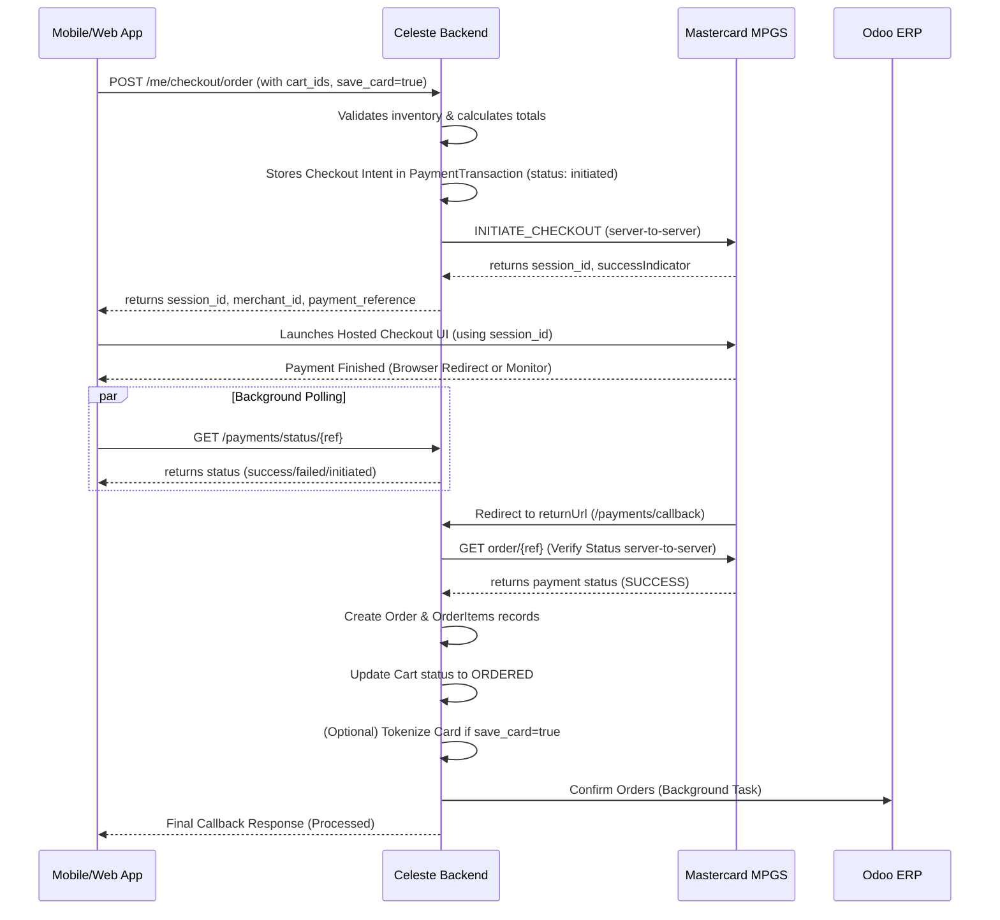

# Mastercard MPGS Hosted Checkout Integration

This document outlines the architecture, configuration, and implementation of the Mastercard Payment Gateway Services (MPGS) Hosted Checkout integration within the Celeste platform.

## 1. High-Level Architecture

The integration follows a **Deferred Order Creation** pattern. This ensures that no order records are persisted in the database until a payment is successfully verified by the Mastercard gateway.

### Sequence Diagram



---

## 2. Configuration

All configurations are managed via environment variables.

| Variable | Description | Example |
| :--- | :--- | :--- |
| `MPGS_MERCHANT_ID` | Your Mastercard Merchant ID | `TESTCELESTENOLKR` |
| `MPGS_API_USERNAME` | API Username (usually `merchant.[ID]`) | `merchant.TESTCELESTENOLKR` |
| `MPGS_API_PASSWORD` | API Password from Portal | `765...` |
| `MPGS_GATEWAY_URL` | Base API URL | `https://cbcmpgs.gateway.mastercard.com/api/rest/version/100` |
| `API_BASE_URL` | The public URL of this server (used for callbacks) | `https://celeste-api-846811285865.asia-south1.run.app` |

---

## 3. Backend Endpoints

### A. Create Checkout Session
**`POST /users/me/checkout/order`**
Initiates the checkout flow. Validates stock and returns the session details needed to launch the payment UI.

**Request:**
```json
{
  "cart_ids": [123, 124],
  "location": { "mode": "delivery", "address_id": 1 },
  "save_card": true
}
```

**Response (`payment_info` object):**
- `session_id`: The MPGS session identifier.
- `merchant_id`: Your Merchant ID.
- `payment_reference`: Use this as the `order.id` in MPGS.

### B. Payment Callback (Internal)
**`GET /payments/callback`**
The URL where MPGS redirects the user after payment. 
**Logic:**
1. Fetches payment status directly from Mastercard servers.
2. If **SUCCESS**: Creates the actual `Order` objects and marks carts as `ORDERED`.
3. If **TOKEN REQUESTED**: Saves the card token for the user.
4. Triggers background synchronization with Odoo.

### C. Status Polling
**`GET /payments/status/{ref}`**
Used by the frontend to check if the deferred order creation has been completed by the callback.

### D. Saved Cards
**`GET /payments/saved-cards`**
Returns a list of previously tokenized cards for the logged-in user.

---

## 4. Frontend Integration Guide

### Web Integration (JS)
You must include the MPGS Hosted Checkout script:
`<script src="https://cbcmpgs.gateway.mastercard.com/static/checkout/checkout.min.js"></script>`

```javascript
function startCheckout(paymentInfo) {
    Checkout.configure({
        session: { 
            id: paymentInfo.session_id 
        }
    });
    Checkout.showPaymentPage();
}
```

### Mobile Integration (WebView)
1. Launch a WebView pointing to an HTML page that runs the logic above.
2. **Security**: Monitor the WebView URL for the `API_BASE_URL/payments/callback` string.
3. **Polling**: While the user is in the payment UI, poll `GET /payments/status/{ref}` in the background every 3 seconds to detect when the backend has finished creating the order.

---

## 5. Security Notes

- **PCI Compliance**: We use **Hosted Checkout**, meaning card details never touch our server. We only store anonymized **tokens**.
- **Server Verification**: The order is only created if our server verifies the payment status directly with Mastercard using our API password.
- **Precision**: All amounts are strictly formatted to 2 decimal places (` {amt:.2f} `) to comply with MPGS requirements.

## 6. Tokenization (Card Savings)

When a user selects "Save Card":
1. Backend sends a `TOKENIZE` request context within the session.
2. After a successful payment, the backend callback retrieves the token and masked card info (`#### 1234`).
3. This is stored in the `user_payment_tokens` table.
4. For future orders, providing the `source_token_id` allows for a pre-filled, one-click payment experience.
