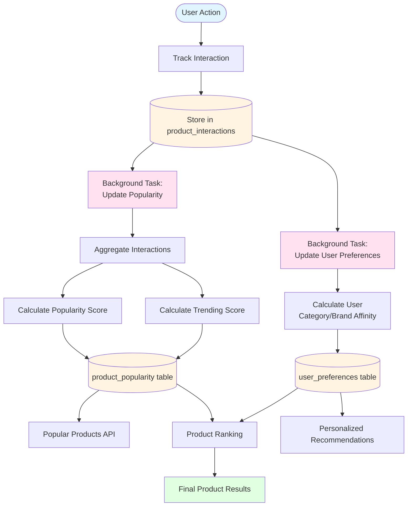
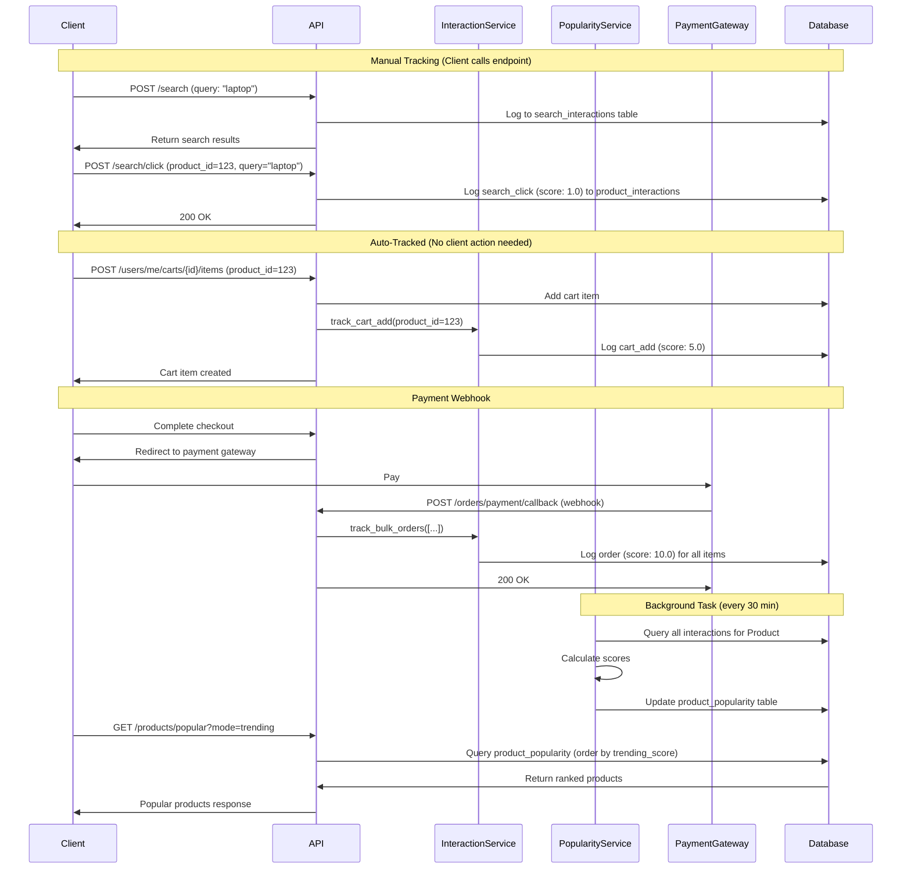

# Popularity, Interaction & Personalization System

## Overview

The system tracks user interactions with products to build popularity metrics and personalize recommendations. All interactions are logged, scored, and aggregated to drive product ranking and user preferences.

## Interaction Tracking

### Interaction Types & Scores

Each user action is tracked and weighted by importance:

| Action | Score | When Tracked | Status |
|--------|-------|--------------|--------|
| **Search Click** | 1.0 | User calls `POST /search/click` after clicking product | ✅ Active (manual) |
| **View** | 2.0 | User views product details | ⚠️ Not implemented (service ready) |
| **Wishlist Add** | 3.0 | User adds product to wishlist | ⚠️ Not implemented (service ready) |
| **Cart Add** | 5.0 | User adds item to cart via API | ✅ Active (auto-tracked) |
| **Order** | 10.0 | Payment confirmed (webhook) | ✅ Active (auto-tracked) |

**Implementation Notes:**
- ✅ **Active (manual)**: Client must explicitly call the endpoint
- ✅ **Active (auto-tracked)**: Automatically tracked when action occurs
- ⚠️ **Not implemented**: Service layer ready, but no user-facing feature yet

### How It Works

**Auto-Tracked Interactions:**
1. User adds to cart → `POST /users/me/carts/{cart_id}/items`
2. API auto-tracks to `product_interactions` table
3. Background task updates popularity scores

**Manual Interactions (Client-Called):**
1. User clicks product in search → Client calls `POST /search/click`
2. API tracks to `product_interactions` table
3. Background task updates popularity scores

**Payment Callback (Webhook):**
1. Payment gateway confirms payment → Webhook `POST /orders/payment/callback`
2. API auto-tracks bulk orders to `product_interactions` table
3. Updates user statistics and preferences

## Popularity System

### Popularity Metrics

Products track 6 aggregate metrics in `product_popularity` table:

- `search_count` - Times product appeared in searches
- `search_click_count` - Times clicked from search
- `view_count` - Total product views
- `cart_add_count` - Times added to cart
- `order_count` - Times purchased
- `popularity_score` - Weighted aggregate score
- `trending_score` - Time-decayed recent activity score

### Popularity Score Calculation

```
popularity_score =
    (view_count × 2.0) +
    (cart_add_count × 5.0) +
    (order_count × 10.0) +
    (search_click_count × 1.0)
```

### Trending Score

Uses **exponential time decay** with 72-hour (3 day) half-life:

- Recent interactions = higher score
- Older interactions decay exponentially
- Only considers last 7 days of activity

```
trending_score = Σ (interaction_weight × time_decay)
time_decay = 0.5^(hours_ago / 72)
```

### Popularity Modes

Query products by different metrics:

- `trending` - Time-decayed recent activity
- `most_viewed` - Highest view count
- `most_carted` - Most added to cart
- `most_ordered` - Best sellers
- `most_searched` - Most clicked from search
- `overall` - Highest popularity score

## Personalization

### User Preferences

System tracks each user's product affinities:

- **Category preferences** - Which categories user interacts with
- **Brand preferences** - Which brands user prefers
- **Recent interactions** - Last 100 interactions
- **Purchase history** - Orders completed

### How Recommendations Work

1. **User interacts** with products
2. **Preferences calculated** from interaction history
3. **Products scored** using:
   - Base relevance (price, inventory) - 50%
   - User preferences (category/brand affinity) - 30%
   - Global popularity - 20%
4. **Diversity applied** - Limit products per category
5. **Recent orders down-ranked** - 70% penalty for recently purchased items

### Cold Start Strategy

New users with < 5 interactions:
- Fall back to popular products
- Show trending items
- No personalization applied

## Background Tasks

Automated jobs keep metrics fresh:

- **Update Popularity** - Every 30 minutes
- **Update User Preferences** - Every 5 minutes
- **Calculate Item Similarity** - Every 24 hours
- **Cleanup Old Interactions** - Every hour

## System Flow



## Detailed Interaction Flow



## API Endpoints

### Popularity Endpoints

- `GET /products/popular` - Get popular products
  - Query params: `mode`, `time_window`, `category`, `limit`
  - Modes: trending, most_viewed, most_carted, most_ordered, overall

### Interaction Tracking

**Manual Tracking (Client must call):**
- `POST /search/click` - Track search result click
  - Body: `{ "query": "string", "product_id": 123 }`
  - Client must call this when user clicks product from search

**Auto-Tracked (No client action needed):**
- `POST /users/me/carts/{cart_id}/items` - Cart addition auto-tracked
- `POST /orders/payment/callback` - Order confirmation auto-tracked (webhook)
- Search queries auto-tracked in `search_interactions` table (not product_interactions)

**Not Yet Implemented:**
- Product view tracking (service ready, no endpoint)
- Wishlist tracking (service ready, no feature)

## Configuration

Key settings in `src/config/constants.py`:

```python
# Interaction scoring
INTERACTION_SCORES = {
    InteractionType.SEARCH_CLICK: 1.0,
    InteractionType.VIEW: 2.0,
    InteractionType.CART_ADD: 5.0,
    InteractionType.WISHLIST_ADD: 3.0,
    InteractionType.ORDER: 10.0,
}

# Trending calculation
POPULARITY_TIME_DECAY_HOURS = 72        # 3-day half-life
TRENDING_RECENT_DAYS = 7                # Consider last 7 days

# Background tasks
TASK_UPDATE_POPULARITY_INTERVAL = 1800  # 30 minutes
TASK_UPDATE_USER_PREFERENCES_INTERVAL = 300  # 5 minutes

# Personalization
RANKING_BASE_RELEVANCE_WEIGHT = 0.5     # 50%
RANKING_PERSONALIZATION_WEIGHT = 0.3    # 30%
RANKING_POPULARITY_WEIGHT = 0.2         # 20%
```

## Database Schema

### product_interactions
```sql
- id (PK)
- user_id (FK)
- product_id (FK)
- interaction_type (enum)
- timestamp
- metadata (jsonb)
```

### product_popularity
```sql
- id (PK)
- product_id (FK, unique)
- search_count
- search_click_count
- view_count
- cart_add_count
- order_count
- popularity_score (calculated)
- trending_score (time-decayed)
- last_interaction
- last_updated
```

## Performance Optimization

1. **Indexes** on all interaction tables for fast aggregation
2. **Background processing** - Don't block user requests
3. **Bulk operations** - Track multiple orders at once
4. **Cached results** - Popular products cached for 15 minutes
5. **Efficient queries** - Pre-calculated scores, not real-time aggregation

## Best Practices

1. **Always track interactions** - More data = better recommendations
2. **Use auto_update=True** for critical paths (checkout)
3. **Query popular products** instead of manual sorting
4. **Leverage trending** for time-sensitive promotions
5. **Monitor background tasks** - Ensure they run successfully
