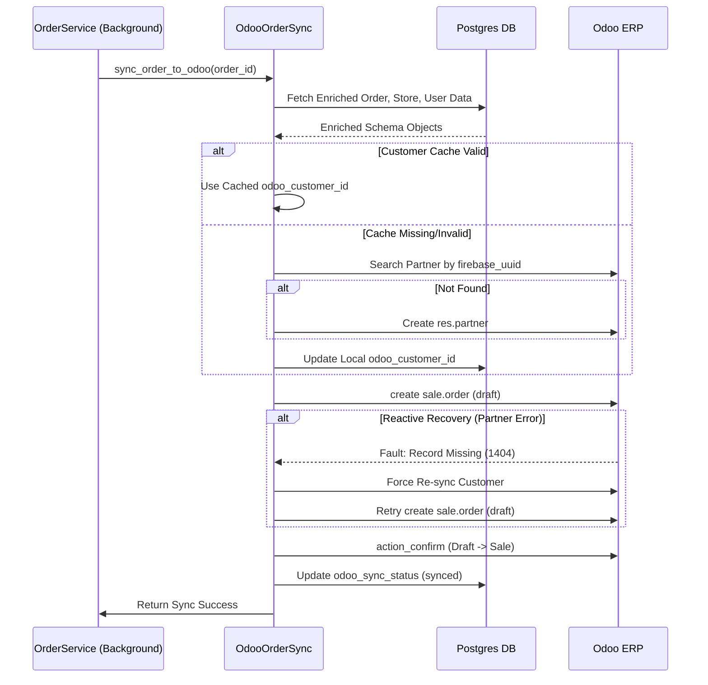

# Odoo Order Synchronization Process

## System Architecture & Flow

## Overview

The synchronization is handled by the `OdooOrderSync` service. It operates as a background task after an order is confirmed in our local database.

---

## Step-by-Step Workflow

### 1. Data Enrichment (Unified Fetch)
To avoid N+1 query problems and redundant database calls, the service performs a unified fetch of all required metadata using our internal services:
- **Order Details**: Fetches the order with its items, including full product metadata (SKUs, base prices).
- **Store Details**: Fetches store information, specifically the `odoo_warehouse_id`.
- **User Details**: Fetches the user profile and delivery addresses to identify the Odoo partner.

### 2. Customer Synchronization (Partner Linking)
The service links the internal user to an Odoo `res.partner` using a tiered search strategy:
1. **Cache Check**: If an `odoo_customer_id` is already present in our `users` table, that ID is used.
2. **UUID Search**: If no cache is found, Odoo is searched for a partner with a matching `firebase_uuid`.
3. **Creation**: If no match is found, a new customer record is created in Odoo with the user's name, phone, and default address.
4. **Local Update**: The resulting `odoo_customer_id` is cached back to our Postgres database for future orders.

### 3. Salesforce Order (SO) Creation
The order is created in Odoo as a `draft` Quote with the following details:
- **Client Reference**: An internal reference format `CELESTE-{id}` is used. The service checks for this reference first to prevent duplicate orders in Odoo.
- **Product Mapping**: Internal product codes are padded to 6 digits (e.g., `123` -> `000123`) to match Odoo's SKU format.
- **Batch Product Search**: All products in the order are searched in Odoo in a single batch request using their SKUs.
- **Pricing & Discounts**: 
    - The `price_unit` is set to the product's Odoo Base Price.
    - Discounts are calculated dynamically as a percentage: `((Base - Final) / Base) * 100`.
- **Fulfillment Logistics**: The order is assigned to the specific `warehouse_id` corresponding to the store where the order originated.
- **Delivery Charge**: If applicable, the delivery charge is added as a separate line item using the `DELIVERY_PRODUCT_ODOO_ID`.

### 4. Reactive Recovery Mechanism
To optimize performance, we skip proactive verification of cached customer records. Instead, we use a reactive approach:
- If the Order Creation fails with a **"Record does not exist"** error for `res.partner` (e.g., if a customer was manually deleted in Odoo), the system catches the error.
- It then triggers a mandatory **Customer Re-sync** (ignoring the cache).
- After re-syncing, it retries the Order Creation once.

### 5. Immediate Order Confirmation
Once the draft order is successfully created:
- The service immediately executes `action_confirm` on the Odoo Sales Order.
- This transitions the order from a `Draft/Quote` to a `Sales Order` in Odoo.
- Note: Network round-trips are minimized by skipping redundant "state check" queries.

### 6. Sync Status Persistence
Finally, the local order record is updated in the database:
- `odoo_sync_status` is set to `synced`.
- `odoo_order_id` and `odoo_customer_id` are stored for future reference.
- Detailed error logs are stored in `odoo_sync_error` if the process fails at any stage.

---

## Performance Optimizations
- **Service Reuse**: Uses `OrderService.get_order_by_id` to aggregate all necessary data in one step.
- **Thread Pool Execution**: All blocking XML-RPC calls are executed in a `ThreadPoolExecutor` to prevent blocking the async event loop.
- **Connection Persistence**: Reuses Odoo authentication sessions across sync cycles.
- **Aggregated Commands**: Uses Odoo's command syntax `(0, 0, {values})` to create the order and all lines in a single atomic API call.
